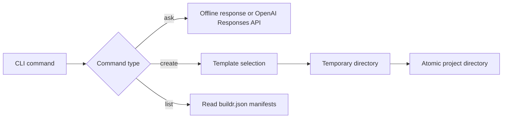

# Buildr architecture

## Boundary

Buildr v0.2 is a small project scaffolder with an optional question-answering command. It is not an autonomous coding agent and does not execute generated code.



## Packaging fix

The original project used a flat layout:

```text
buildr-cli/
├── buildr/
├── calculator_app/
└── stock_dashboard/
```

Setuptools interpreted every top-level folder as a possible package. Moving examples into `projects/` did not solve discovery because `projects/` was still at the package-discovery level.

Version 0.2 uses:

```text
buildr-cli/
├── src/buildr_cli/
├── examples/
└── projects/       # ignored generated output
```

`pyproject.toml` explicitly searches only inside `src` and includes only `buildr_cli*`. Generated folders can no longer become accidental distribution packages.

## Safety properties

- Existing project directories are never overwritten.
- Names are converted to safe slugs.
- Project paths must remain inside the selected output directory.
- Files are written to a temporary directory and renamed only after generation succeeds.
- Buildr does not run generated files or shell commands.
- API keys come from the environment and are excluded from Git.
- Tests mock the OpenAI client; CI never needs a real API key.

## Known limitations

- Only calculator, CSV stock-summary, and generic Python starter templates exist.
- AI answers are single-turn and have no project-file context.
- Buildr does not edit existing projects.
- It does not validate generated applications beyond its own template tests.

